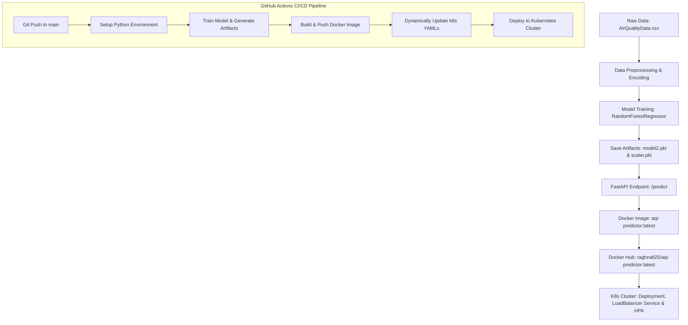

# AQI Predictor: End-to-End Production ML Pipeline

A professional, enterprise-grade end-to-end Machine Learning pipeline that predicts Air Quality Index (AQI) pollutant levels. This project spans data preprocessing, model training, API deployment, containerization, local orchestration with Kubernetes, and automated CI/CD deployment.

---

## 🏗️ System Architecture

The following diagram illustrates the complete data, build, and deployment workflow:



---

## 📂 Project Structure

```plaintext
├── .github/
│   └── workflows/
│       └── ci-cd.yml         # CI/CD pipeline configuration
├── api/
│   ├── __init__.py
│   └── main.py               # FastAPI application code
├── data/
│   ├── processed/            # Preprocessed datasets (ignored by Git)
│   └── raw/
│       └── AirQualityData.csv # Raw AQI dataset
├── k8s/
│   ├── autoscaler.yaml       # HorizontalPodAutoscaler (HPA) config
│   ├── deployment.yaml       # Kubernetes Deployment config
│   └── service.yaml          # LoadBalancer Service config
├── ml/
│   ├── __init__.py
│   ├── data.py               # Data loading and cleaning functions
│   ├── infercense.py         # Prediction inference wrapper
│   └── model.py              # Model architecture and training logic
├── model/
│   ├── metrices.json         # Evaluation metrics output
│   ├── model2.pkl            # Trained Random Forest Regressor model
│   └── scaler.pkl            # StandardScaler instance
├── Dockerfile                # Docker container build script
├── train.py                  # Training orchestrator script
├── evaluation.py             # Evaluation script
├── requirements.txt          # Python dependency list
└── README.md                 # Project documentation (this file)
```

---

## 🤖 Machine Learning Pipeline

### 1. Data Preprocessing & Scaling
- **Numeric Handling**: Null values in features are handled, and values are coerced to float.
- **Categorical Encoding**: Categorical fields (`state`, `city`, `pollutant_id`) are mapped to numeric values using `LabelEncoder`.
- **Feature Scaling**: Scaled using scikit-learn's `StandardScaler` to normalize feature distributions.

### 2. Model Training
- **Algorithm**: `RandomForestRegressor` optimized via `GridSearchCV` hyperparameter tuning.
- **Hyperparameter Grid**:
  - `n_estimators`: `[100, 300, 500]`
  - `max_depth`: `[10, 20, None]`
  - `min_samples_split`: `[2, 5]`
  - `max_features`: `['sqrt', 'log2']`

### 3. Model Evaluation Metrics
The model has been evaluated against test datasets with the following performance scores:

| Metric | Score | Description |
|---|---|---|
| **MAE** | 9.143 | Mean Absolute Error |
| **MSE** | 230.886 | Mean Squared Error |
| **R²** | 0.865 | Coefficient of Determination |
| **MAPE** | 27.7% | Mean Absolute Percentage Error |
| **EVS** | 0.865 | Explained Variance Score |

---

## ⚡ REST API Documentation (FastAPI)

The API is served using **Uvicorn** and exposes three endpoints.

### Endpoints

#### 1. Root / Health Check
- **Method**: `GET`
- **Path**: `/`
- **Description**: Verifies if the service is up and running.
- **Response**:
  ```json
  { "status": "AQI Predictor API is running" }
  ```

#### 2. Get Evaluation Metrics
- **Method**: `GET`
- **Path**: `/metrics`
- **Description**: Returns the precalculated model metrics.
- **Response**:
  ```json
  {
    "MAE": 9.143,
    "MSE": 230.886,
    "R2": 0.865,
    "MAPE": 0.277,
    "EVS": 0.865
  }
  ```

#### 3. Prediction Endpoint
- **Method**: `POST`
- **Path**: `/predict`
- **Description**: Submits inputs to predict the maximum pollutant level (`pollutant_max`).
- **Request Body (JSON)**:
  ```json
  {
    "pollutant_min": 10.0,
    "pollutant_avg": 50.0,
    "state": 1,
    "city": 1,
    "pollutant_id": 1,
    "latitude": 20.0,
    "longitude": 70.0
  }
  ```
- **Response**:
  ```json
  {
    "pollutant_max_prediction": 81.96
  }
  ```

---

## 🛠️ Local Development & Testing

### 1. Local Setup
Create a virtual environment and install the required dependencies:
```bash
python -m venv venv
# On Windows
.\venv\Scripts\Activate
# On Linux/macOS
source venv/bin/activate

pip install -r requirements.txt
```

### 2. Run Model Training
Orchestrate model training, which generates the scaler and model binaries in the `/model` directory:
```bash
python train.py
```

### 3. Run API Locally
Start the FastAPI server locally on port `8000`:
```bash
uvicorn api.main:app --reload
```

Test it using `curl`:
```bash
curl http://localhost:8000/
```

---

## 🐳 Dockerization

The container uses `python:3.12-slim` to maintain a lightweight footprint.

### Build the Image
```bash
docker build -t raghnall25/aqi-predictor:latest .
```

### Run Locally
```bash
docker run -p 8000:8000 raghnall25/aqi-predictor:latest
```

---

## ☸️ Kubernetes Deployment

The deployment runs on a local Kubernetes engine (such as Docker Desktop or Minikube) and scales dynamically.

### Apply Resources
Deploy the application, expose it via a LoadBalancer service, and configure the autoscaler:
```bash
kubectl apply -f k8s/
```

### Verify Status
```bash
# Check Pods
kubectl get pods

# Check Services
kubectl get service aqi-predictor-service

# Check Autoscaler (HPA)
kubectl get hpa aqi-predictor-hpa
```

### Test Service
Test the application via the local load balancer mapping on port `80`:
```bash
curl http://localhost/
```

---

## 🔄 CI/CD Pipeline

The GitHub Actions workflow is defined in `.github/workflows/ci-cd.yml` and triggers on pushes to the `main` branch. 

It automates:
1. **Model Retraining**: Runs the training pipeline to generate the model artifacts dynamically on the runner.
2. **Docker Builds**: Packages the newly generated model artifacts with the codebase.
3. **Registry Upload**: Pushes the new Docker image directly to Docker Hub.
4. **Cluster Deployment**: Dynamically updates Kubernetes deployment specs with target tags and pull policies, then deploys to the production cluster.
